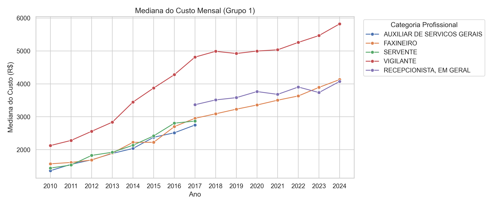
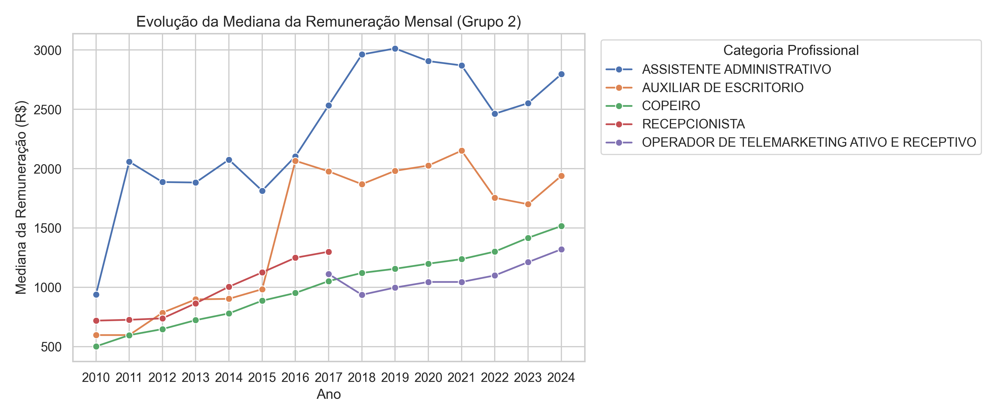

# Histórico de terceirizados (2010 a 2024)

Aqui vamos analisar o histórico dos dados de terceirizados do governo federal. Com a contribuição da CGU, conseguimos os dados desde 2010, o que nos 14 anos de informações sobre os terceirizados que foram contratados no administração pública federal. 

É importante mencionar que, como são os órgãos que encaminham as informações para a CGU, não há dados de todos os órgãos. Há três informações validadas pela CGU antes da publicação na página de Dados Abertos: CBO (Classificação Brasileira de Ocupações) a partir de 2018; CPF e CNPJ da empresa contratada pelo órgão para a terceirização. Portanto, há margem para erros e todas as análises aqui discutidas devem ser lidas de maneira crítica. Como há informações que estão suscetíveis a erros de preenchimento, verificamos a presenção de valores nulos e outliers que não são passíveis de correção, já que não temos acesso fácil e rápido à informação preenchida quando do ano de carga de submissão dos dados dos terceirizados pelo órgão. 

Diante disso, os valores nulos e outliers foram retirados dos dados utilizados para as análises aqui propostas. A quantidade retirada não é significativa frente ao universo dos dados validados - em torno de 3 milhões de linhas. Para verificar o tratamento feito para construir as análises aqui listadas, [visualize o notebook com os códigos](https://nbviewer.org/github/lab-dados-seges/dados-terceirizados/blob/main/analises/historico_terceirizados.ipynb).

## Terceirizados no governo federal

Para verificar a quantidade de terceirizados por ano na administração pública federal, vamos utilizar a variável ano de carga. Isso significa que foi o ano em que o órgão submeteu a informação daquele terceirizado. Vejamos a distribuição do quantitativo total:

Gráfico 1 – Quantitativo total de terceirizados de 2010 a 2024.

É possível perceber uma flutuação considerável de 2010 a 2017. Em 2018, houve uma redução de 33,7% de terceirizados ao comparar com 2017. Em 2019 há o maior pico de contratação, totalizando 274.722 terceirizados. A partir de 2010 há uma certa constância no número de entradas de terceirizados. As flutuações até 2017 podem estar ligadas à organização interna dos órgãos para submeter os dados exigidos pela CGU. Em 2019 há mudança de governo e um significativo aumento de terceirizados.

A seguir, veremos um gráfico com os orgãos com as maiores quantidades de terceirizados por ano. Para melhor visualização, escolhemos os top 3:

Gráfico 2 – Top 3 órgãos com o maior quantitativo total de terceirizados entre 2010 e 2024.

Dez órgãos aparecem no gráfico: MEC (Ministério da Educação, MINC (Ministério da Cultura), MPS (Ministério da Previdência Social), MS (Ministério da Saúde), MT (Ministério dos Transportes), MF (Ministério da Fazenda), MDS (Ministério do Desenvolvimento Social), ME (Ministério da Economia), MJSP (Ministério da Justiça e Segurança Pública) e MTP (Ministério do Trabalho e Previdência Social).

Claramente vemos que o MEC é o órgão que acumula o maior quantitativo de terceirizados desde 2010. O Ministério da Economia foi criado em 2019 e aglutinou atribuições que antes eram de outros órgãos, assim, é possível perceber o aumento de terceirizados vinculados ao ME, entre 2019 e 2021. A partir desse gráfico é possível perceber que MEC, MS e Previdência Social figuram entre os órgãos com maiores quantitativos de terceirizados desde 2010.

Para entender o custo desses terceirizados, vamos utilizar a variável relacionada ao custo mensal do terceirizado para a empresa. Como há órgãos com um quantitativo alto em relação aos demais, a análise foi feita em cima de percentual de participação dos top 10 órgãos no custo total de terceirizados do ano para melhor visualização dos dados.

Gráfico 3 – Participação no custo total de terceirizados dos top 10 órgãos com o maior quantitativo total de terceirizados entre 2010 e 2024.

Veja que, como o esperado, o MEC possui a maior participação no custo total desde 2010. Apenas um órgão que apareceu no Gráfico 2 e que não apareceu aqui: MTP. No lugar dele, veio o MCTI. Provavelmente essa troca aconteceu porque o custo dos terceirizados do MCTI é maior do que o do MTP, devido à alta especialização dos contratados pelo MCTI. O gráfico abaixo mostra a mediana dos maiores custos do MCTI:

Gráfico 4 – Maiores custos mensais medianos de terceirizados contratados pelo MCTI.

É possível observar que os três maiores custos mensais medianos são das categorias profissionais de engenheiro eletrônico, engenheiro mecânico e analista de negócios com valores acima de 30 mil reais mensais. Isso mostra que a participação do MCTI no custo mensal mediano do Gráfico 3 é devido à especialização e a questões relativas a piso salarial para engenheiros - para engenheiro eletrônico em 2025, por exemplo, fica na faixa de 10 mil reais.

## Categorias profissionais dos terceirizados

Agora que já vimos um panorama de quantitativo e de custo por órgãos, vamos analisar as categorias profissionais contratadas pelo governo federal. Essa análise é importante para a implementação da política de cotas para mulheres em situação de violência porque podemos identificar quais categorias são mais contratadas, assim como os valores pagos ao longo dos anos. Para a (re)inserção de mulheres vítimas de violência é fundamental que haja um retorno econômico e financeiro para elas.

Diante disso, vamos analisar as top 3 categorias mais contratadas ao longo dos anos:

Gráfico 5 – Top 3 categorias profissionais contratadas entre 2010 e 2024.

A partir de 2017 é possível observar uma mudança na nomenclatura das categorias profissionais. Como a ideia é observar o histórico, optamos por não aglutinar as categorias profissionais por não termos embasamento metodológico para isso, o que impacta na análise feita. Há duas categorias de recepcionista: recepcionista e recepcionista, em geral. Na atual CBO, há diversos tipos de recepcionista, então optamos por deixar essas duas categorias como distintas para identificar a mudança de padrão. 

Entre 2010 e 2016 as categorias de Vigilante, Auxiliar de Serviços Gerais e Servente configuraram como as categorias com mais profissionais contratados. A partir de 2017, ainda que Vigilante permaneça como a categoria mais contratada, temos agora Recepcionista, em Geral e Faxineiro. Entre 2023 e 2024 a categoria de Recepcionista, em Geral dá lugar a Assistente Administrativo.

Para compreender tanto o custo mensal quanto o salário mensal, pegamos as 10 categorias com os maiores quantitativos de terceirizados e dividimos em dois grupos para melhor visualização dos dados. O Grupo 1 representa as categorias profissionais de Vigilante, Faxineiro, Servente, Auxiliar de Serviços Gerais e Recepcionista, em Geral. Este grupo representa as categorias com os cinco maiores quantitativos de contratações. O Grupo 2, por sua vez, são os outros 5 - entre 5 a 10, dos top 10 - quantitativos: Assistente Administrativo, Auxiliar de Escritório, Recepcionista, Operador de Telemarketing Ativo e Receptivo e Copeiro.

### Custo mensal mediano por categoria

Aqui vamos analisar o custo mensal mediano dos dois grupos de 2010 a 2024. Esse custo refere-se, como dito anteriormente, ao custo mensal do terceirizado para empresa.

Gráfico 6 – Custo mensal mediano das categorias do Grupo 1 entre 2010 e 2024.

A partir desse gráfico conseguimos perceber claramente o ponto de mudança de padrão de nomenclatura das categorias profissionais. Os custos mensais de Auxiliar de Serviços Gerais e de Servente são computados até 2017, daí em diante aparece Recepcionista, em Geral. A categoria de vigilante possui o maior custo mensal - isso faz sentido, já que o salário de vigilante costuma ser maior do que as demais categorias profissionais mostradas neste gráfico. Observe que Recepcionista, em Geral, de 2017 a 2022, está com custo mensal acima de Faxineiro. Em 2023 o custo de Faxineiro fica acima para, em 2024, o custo dessas duas categorias profissionais estarem basicamente no mesmo patamar - Faxineiro está um pouco acima de Recepcionista, em Geral.

Vamos analisar o Grupo 2:

Gráfico 7 – Custo mensal mediano das categorias do Grupo 2 entre 2010 e 2024.

Aqui também é possível identificar as mudanças de padrão de nomenclatura das categorias. Até 2017 temos Recepcionista - no Gráfio 6 a categoria Recepcionista, em Geral começa a aparecer exatamente no ponto no qual Recepconista termina de aparecer - e daí em diante aparece Operador de Telemarketing Ativo e Receptivo. Esta categoria tem uma mudança abrupta no custo, caindo consideravalmente de 2017 a 2018, e depois, gradualmente, aumenta até seu pico em 2024. Perceba que na época da pandemia da Covid-19, entre 2020 e 2022 o custo estagna e retoma ao crescimento. Durante esses anos de pandemia, a partir dos gráficos 6 e 7 percebemos que os maiores impactados foram Assistente Administrativo, Auxiliar de Escritório e Recepcionista, em Geral.

As categorias mostradas no Gráfico 7 que aparecem em 2017 até 2024 têm um aumento expressivo de 2023 para 2024, inclusive Assistente Administrativo que estava em queda desde 2019.

### Salário mensal mediano por categoria

Agora vamos analisar a mediana salarial das categorias, também divididas em Grupos, da mesma forma que os gráficos anteriores.

Gráfico 8 – Mediana do salário mensal das categorias do Grupo 1 entre 2010 e 2024.

Das categorias apresentadas no gráfico acima, Vigilante é a que tem a maior remuneração ao longo dos anos. Logo depois, a partir de 2017, temos Recepcionista, em Geral e, em terceiro, Faxineiro. Perceba que, ainda que o custo mensal dessas duas categorias esteja próximo, Recepcionista, em Geral recebe mais que Faxineiro. Isso se deve, talvez, pela quantidade contratada pelos órgãos. Conforme Gráfico 5, desde 2017 a categoria Faxineiro é a segunda maior em número de contratação, seguida da Recepcionista, em Geral. Assim, o custo é elevado pela quantidade, mas não se reflete no salário recebido por esses profissionais.

Desde 2022, o salário mediano de Vigilante tem um aumento considerável, passando da faixa de R$ 2.250,00 mensais.

Agora vejamos o Grupo 2:

Gráfico 9 – Mediana do salário mensal das categorias do Grupo 2 entre 2010 e 2024.

Aqui temos mudanças mais bruscas, principalmente ao observar as categorias de Assistente Administrativo e Auxiliar de Escritório. Conforme vimos o impacto no custo mensal durante a pandemia de Covid-19, aqui temos o impacto na remuneração dessas duas categorias profissionais, tornando a aumentar apenas a partir de 2023. O pico da remuneração de Assistente Administrativo foi em 2019, com cerca de R$ 3.000,00 mensais, ainda não tendo recuperado esse valor até 2024.