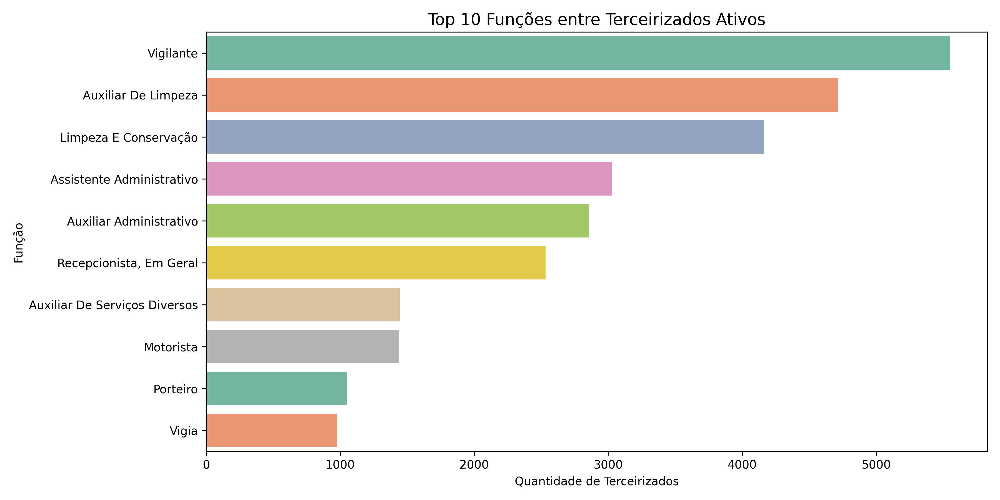
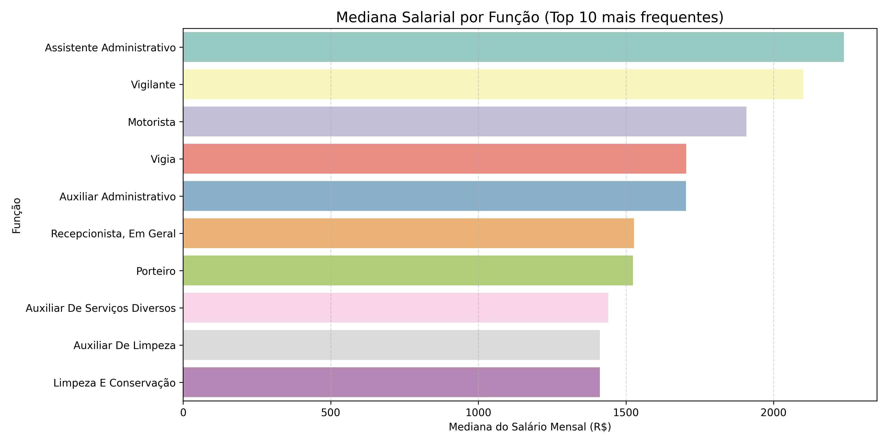

## Terceirizados ativos nos contratos do Governo Federal

Nesta seção analisaremos os servidores que estão com vínculo ativo nos contratos do Governo Federal. O objetivo é identificar características, padrões e pontos de atenção que apoie o processo de implementação da política estabelecida a partir do Decreto nº 11.430/2023. A base de dados utilizada foi raspada do ContratosGov, além dos cruzamentos com a base histórica da CGU para termos o valor do salário mensal e com as bases do CAGED e do RAIS.

### Categorias com mais profissionais ativos

Na base de dados do ContratosGov, há a variável "Função" que identifica a categoria profissional do terceirizado. Vejamos a distribuição do quantitativo dessas funções a partir do gráfico a seguir:

Gráfico 10 – Top 10 funções com o maior quantitativo de terceirizados ativos.

Acompanhando a série histórica discutida na seção 1 deste relatório, temos Vigilante como o maior quantitativo de terceirizados ativos, seguido por Auxiliar de Limpeza, Limpeza e Conservação e Assistente Administrativo. É possível compreender que Auxiliar de Limpeza e Limpeza e Conservação sejam próximos, mas como há distinção na base, deixamos assim.

### Mediana salarial das categorias

Criamos um tópico específico para discutirmos algumas análises salariais, devido à importância de inserção econômica-profissional das mulheres em situação de violência.

#### Das categorias com maior quantitativo de terceirizados

Abaixo conseguimos visualizar a mediana salarial das categorias apresentadas anteriormente - categorias com os 10 maiores quantitativos de terceirizados ativos.

Gráfico 11 – Mediana salarial (R$) do top 10 funções com o maior quantitativo de terceirizados ativos.

Para aprofundarmos a análise, temos a seguir um gráfico calculando a mediana do valor mensal recebido x carga horária semanal - que na base do ContratosGov está na variável "Jornada Semanal". Para o cálculo do valor da hora dessas categorias, vamos multiplicar por 4.33 porque é uma média de semana por mês considerando 12 meses. O cálculo ficará assim: valor_hora = vl_mensal_salario / (Jornada Semanal x 4.33).

Gráfico 12 – Mediana do valor da hora (R$) dos top 10 funções com o maior quantitativo de terceirizados ativos.

#### Das categorias com os maiores salários

Para contrastar com os gráficos anteriores, fizemos uma análise das categorias com as maiores medianas de valor/hora.

Gráfico 13 – As top 10 funções com a maior mediana valor/hora (R$).

Aqui conseguimos identificar disparidades importantes em relação ao Gráfico 12. Enquanto no Gráfico 13, as funções recebem a partir de 30,00 reais por hora, no Gráfico 12, a categoria com o maior valor de hora é Assistente Administrativo com menos de R$ 12,00.