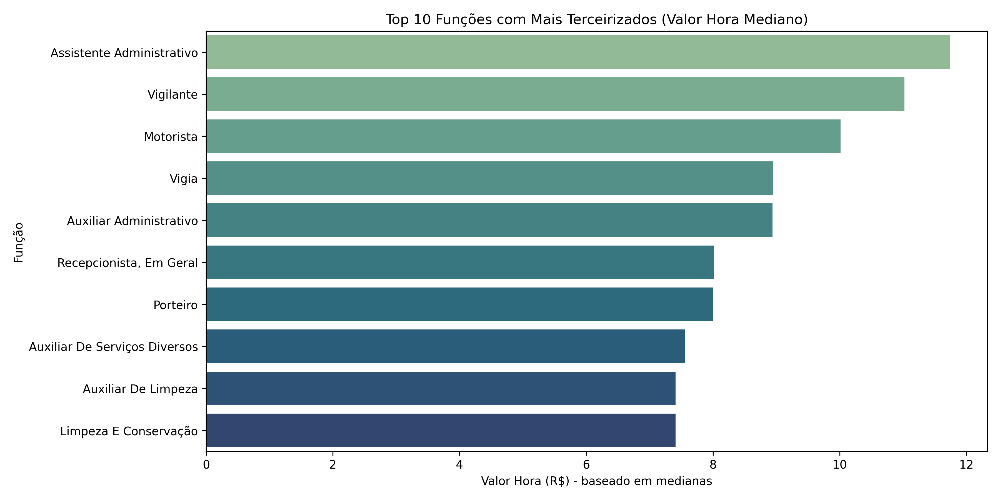
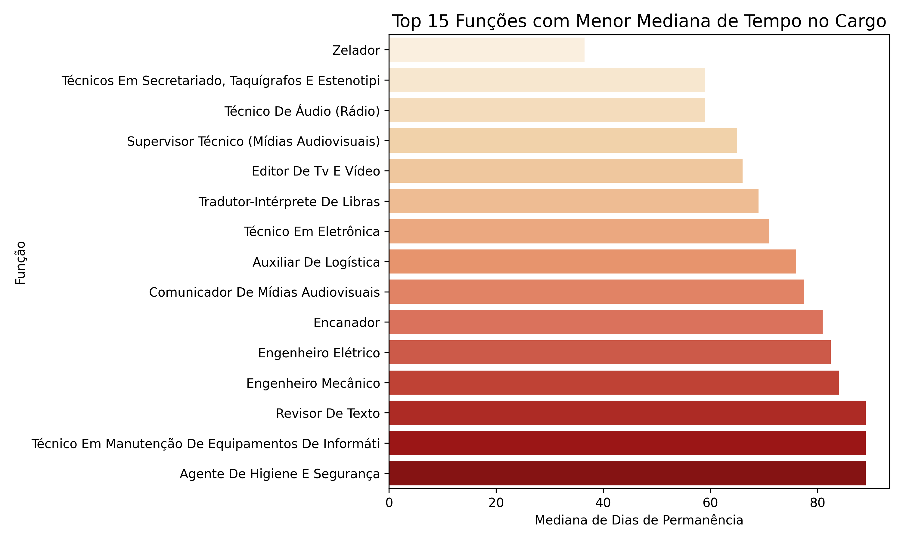
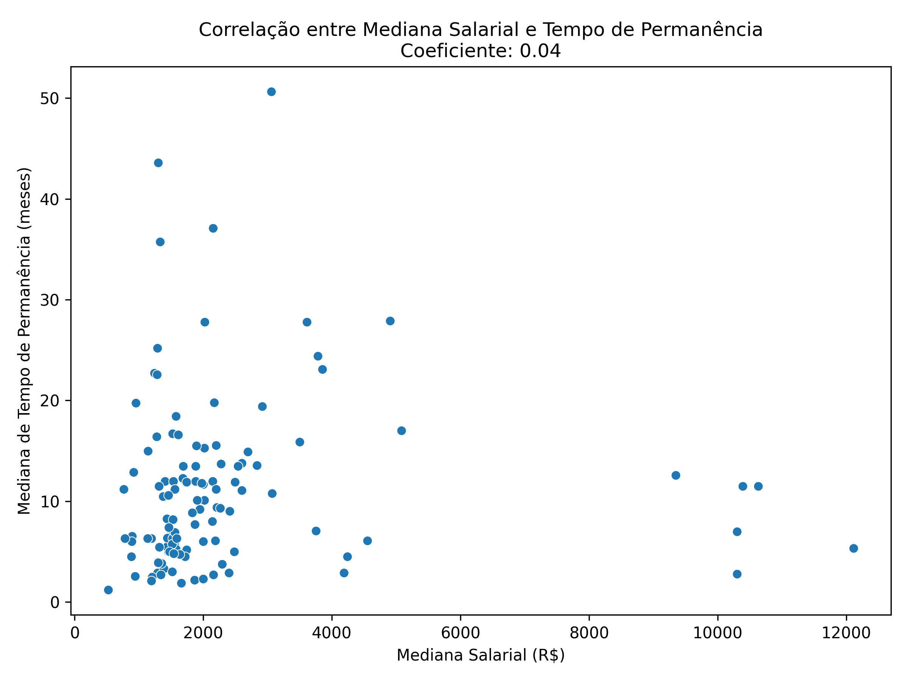

# Terceirizados ativos e ativos nos contratos do Governo Federal

Nesta seção analisaremos os terceirizados que estão com vínculo ativo e inativo nos contratos do Governo Federal. O objetivo é identificar características, padrões e pontos de atenção que apoie o processo de implementação da política estabelecida a partir do Decreto nº 11.430/2023. Os dados dos servidores inativos serão utilizados para identificar a rotatividade e o tempo de permanência dos terceirizados, uma vez que nesta base do ContratosGov há variáveis com a data de início e de fim de cada terceirizado. A base de dados utilizada foi raspada do ContratosGov em 22/04/2025. Para verificar o tratamento feito para construir as análises aqui listadas, [visualize o notebook com os códigos](https://nbviewer.org/github/lab-dados-seges/dados-terceirizados/blob/main/analises/terceirizados_contratosgov.ipynb).

## Categorias com mais profissionais ativos

Na base de dados do ContratosGov, há a variável "Função" que identifica a categoria profissional do terceirizado. Vejamos a distribuição do quantitativo dessas funções a partir do gráfico a seguir:

Gráfico 10 – Top 10 funções com o maior quantitativo de terceirizados ativos.

Acompanhando a série histórica discutida na seção 1 deste relatório, temos Vigilante como o maior quantitativo de terceirizados ativos, seguido por Auxiliar de Limpeza, Limpeza e Conservação e Assistente Administrativo. É possível compreender que Auxiliar de Limpeza e Limpeza e Conservação sejam próximos, mas como há distinção na base, deixamos assim. Caso tivesse a CBO, poderíamos fazer esse cruzamento e identificar proximidade das classificações, mas as funções listadas na base do ContratosGov estão apenas com o nome.

## Mediana salarial das categorias

Criamos um tópico específico para discutirmos algumas análises salariais, devido à importância de inserção econômica-profissional das mulheres em situação de violência.

### Das categorias com maior quantitativo de terceirizados

Abaixo conseguimos visualizar a mediana salarial das categorias apresentadas anteriormente - categorias com os 10 maiores quantitativos de terceirizados ativos.

Gráfico 11 – Mediana salarial (R$) do top 10 funções com o maior quantitativo de terceirizados ativos.

Para aprofundarmos a análise, temos a seguir um gráfico calculando a mediana do valor mensal recebido em relação à carga horária semanal - que na base do ContratosGov está na variável "Jornada Semanal". Para o cálculo do valor da hora dessas categorias, vamos multiplicar por 4.33 porque é uma média de semana por mês considerando 12 meses. O cálculo ficará assim: valor_hora = vl_mensal_salario / (Jornada Semanal x 4.33).

Gráfico 12 – Mediana do valor da hora (R$) dos top 10 funções com o maior quantitativo de terceirizados ativos.

Os gráficos 11 e 12 refletem valores parecidos, assim conseguimos identificar que, ainda que proporcionalmente à carga horária, as funções apresentadas permanecem na mesma ordem.

### Das categorias com os maiores salários

Para contrastar com os gráficos anteriores, fizemos uma análise das categorias com as maiores medianas de valor/hora.

Gráfico 13 – As top 10 funções com a maior mediana valor/hora (R$).

Aqui conseguimos identificar disparidades importantes em relação ao Gráfico 12. Enquanto no Gráfico 13, as funções recebem a partir de 30,00 reais por hora, no Gráfico 12, a categoria com o maior valor de hora é Assistente Administrativo com menos de R$ 12,00.

## Rotatividade e permanência no posto

Para identificarmos a rotatividade e a permanência dos terceirizados nos postos, utilizamos a base de terceirizados raspada do ContratosGov a partir do filtro de inativo na variável "Situação". Assim conseguimos observar a data de início e de fim dos contratos e calcular a mediana.

### Rotatividade dos inativos

Para observar a relação entre funções e tempo de permanência, fizemos dois gráficos: um com as 15 funções com menor mediana de tempo de permanência e outro com as 15 funções com maior mediana de tempo de permanência. O cálculo da permanência foi feita a partir da mediana da contagem dos dias entre a data de início e de fim dos terceirizados que estão com situação inativa.

Gráfico 14 – As funções com as 15 menores medianas de tempo de permanência em dias.

A função de zelador ficou por menos de 40 dias - o menor valor entre as outras funções. Engenheiro Elétrico, apesar de configurar no gráfico 13 como uma das funções com maior valor de hora em reais, aqui está como uma função com uma rotatividade significativa.

Gráfico 15 – As funções com as 15 maiores medianas de tempo de permanência em dias.

O gráfico acima demonstra que, nos casos dos terceirizados inativos, temos Bombeiro Hidráulico e Técnico de Suporte de TI com as maiores medianas de tempo de permanência, ultrapassando 1300 dias - ou por volta de 3 anos e meio de permanência. É importante lembrar que pode haver mudança de empresa contratante, entre outros fatores, que impactam no tempo de permanência dos terceirizados.

### Tempo de permanência das funções com maior quantitativo de contratos

Anteriormente, chegamos, a partir da base de ativos dos terceirizados, que as funções com o maior quantitativo de contratados são: Vigilante, Auxiliar de Limpeza, Limpeza e Conservação, Assistente Administrativo, Auxiliar Administrativo, Recepcionista, em Geral, Auxiliar de Serviços Diversos, Motorista, Porteiro e Vigia. Portanto, é interessante observar o tempo de permanência em meses de terceirizados com essas funções, conforme gráfico a seguir:

Gráfico 16 – Tempo de permanência (em meses) das top 10 funções com maior quantitativo.

Auxiliar de Serviços Diversos, Vigilante, Porteiro, Auxiliar Administrativo e Vigia permaneceram por mais de 1 ano nos postos. Já Auxiliar de Limpeza permaneceu entre 6 e 8 meses.

### Correlação entre mediana salarial e tempo de permanência

O gráfico abaixo representa a correlação entre mediana salarial e tempo de permanência em meses dos terceirizados inativos:

Gráfico 17 – Correlação entre mediana salarial e tempo de permanência em meses.

A correlação de Spearman é de 0.04, o que significa que não há evidência de correlação entre a mediana salarial e o tempo de permanência nos dados aqui apresentados. 