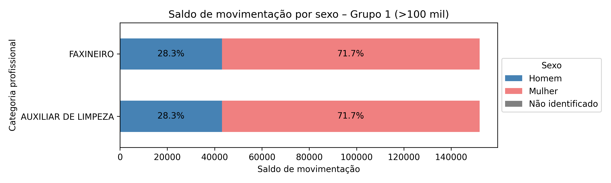
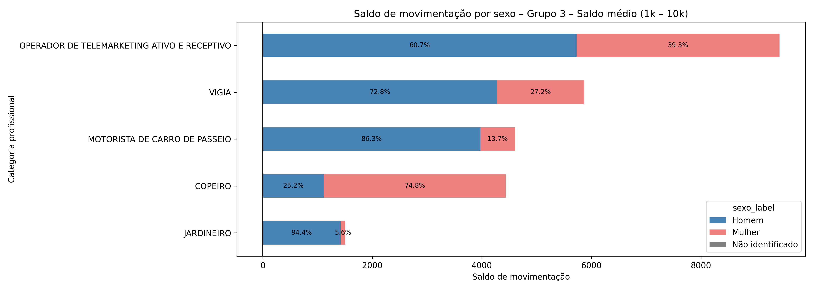
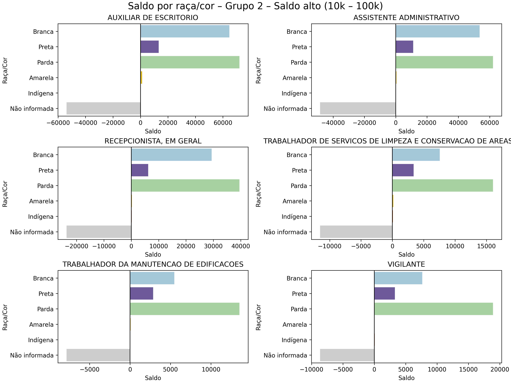
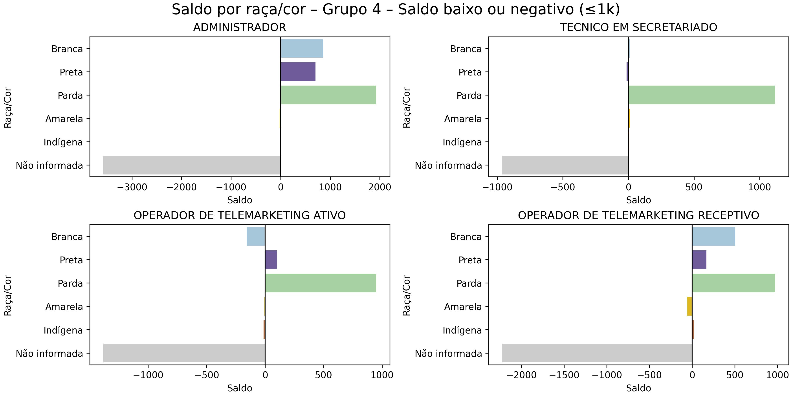
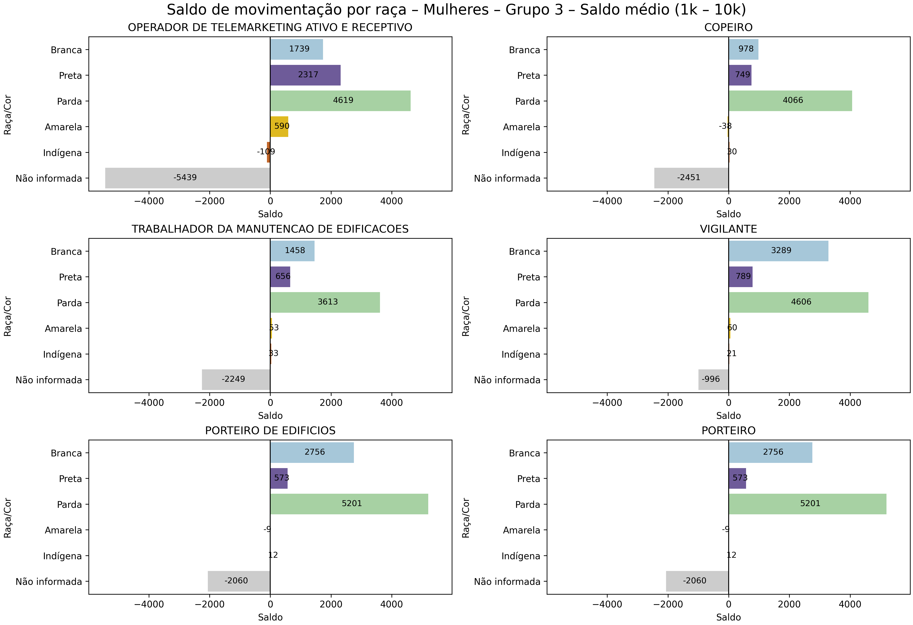

## Saldo líquido de empregos formais das categorias de interesse no ano de 2024

Nesta seção vamos analisar os dados do CAGED, filtrando apenas as categorias profissionais com CBO - expresso ou que foi possível identificar na base do histórico da CGU - com os maiores quantitativos de terceirizados entre 2010 e 2024, quais sejam: 

- 517330 - VIGILANTE
- 514320 - FAXINEIRO
- 422105 - RECEPCIONISTA, EM GERAL
- 411010 - ASSISTENTE ADMINISTRATIVO
- 411005 - AUXILIAR DE ESCRITORIO
- 422310 - OPERADOR DE TELEMARKETING ATIVO E RECEPTIVO
- 422305 - OPERADOR DE TELEMARKETING ATIVO
- 517410 - PORTEIRO DE EDIFICIOS
- 351505 - TECNICO EM SECRETARIADO
- 517410 - PORTEIRO
- 513425 - COPEIRO
- 514320 - AUXILIAR DE LIMPEZA
- 514325 - TRABALHADOR DA MANUTENCAO DE EDIFICACOES
- 513425 - COPEIRO
- 782305 - MOTORISTA DE CARRO DE PASSEIO
- 252105 - ADMINISTRADOR
- 514225 - TRABALHADOR DE SERVICOS DE LIMPEZA E CONSERVACAO DE AREAS PUBLICAS
- 422315 - OPERADOR DE TELEMARKETING RECEPTIVO
- 622010 - JARDINEIRO
- 517420 - VIGIA

A partir desta lista, filtramos a base de dados do CAGED, utilizando as planilhas de movimentação de cada mês do ano de 2024 para obter o saldo de movimentações. Para melhorar a visualização dos dados, optamos por dividir as categorias da lista acima em 4 grupos de acordo com o saldo de movimentação do ano. Isso foi necessário porque há categorias com um salto com valor alto, enquanto outros possuem saldo negativo. A divisão entre os grupos ficou da seguinte maneira:        
- Grupo 1 – Saldo altíssimo: acima de 100000
- Grupo 2 – Saldo alto: entre 10000 e 100000
- Grupo 3 – Saldo médio: entre 1000 e 10000
- Grupo 4 – Saldo baixo ou negativo: menor ou igual a 1000

É importante mencionar que os dados mostrados nos gráficos referentes ao Grupo 1 são os mesmos, já que a CBO de Faxineiro e Auxiliar de Limpeza é o mesmo. Porém, como essas categorias aparecem como distintas no histórico da CGU, optamos por manter assim.

Para verificar o tratamento feito para construir as análises aqui listadas, [visualize o notebook com os códigos](https://nbviewer.org/github/lab-dados-seges/dados-terceirizados/blob/main/analises/saldo_caged.ipynb).

### Saldo total líquido de empregos formais

Aqui iremos observar o saldo líquido do CAGED em 2024 a partir do gráfico abaixo:

Gráfico 18 – Saldo líquido de empregos formais no ano de 2024 das categorias de interesse.

Faxineiro e Auxiliar de Limpeza são as categorias com um saldo maior, o que indica que há um saldo positivo (as admissões superaram os desligamentos) significativo. A partir de Operador de Telemarketing Ativo e Receptivo há uma diminuição considerável no saldo, chegando até às três categorias com saldo negativo (os desligamentos superaram as admissões): Administrador (-118), Operador de Telemarketing Ativo (-514) e Operador de Telemarketing Receptivo (-626).

### Distribuição de gênero nos saldos líquidos 

Como a política de cota para mulheres delineada pelo Decreto nº 11.430/2023 é uma política de gênero também, o gráfico abaixo mostra a distribuição das mulheres nos saldos de empregos formais. Conforme explicado no início da seção, as categoriais de interesse foram agrupadas a partir de faixas de saldo líquido para melhor visualização de dados. A variável utilizada para a análise de gênero foi "sexo", uma vez que é assim que consta no dicionário de dados do CAGED. 

Gráfico 19 – Saldo líquido por gênero das categorias do Grupo 1.

Como as categorias acima possuem um saldo líquido alto, é possível chegar à conclusão que as mulheres configuram uma grande parte do saldo positivo da categoria.

Gráfico 20 – Saldo líquido por gênero das categorias do Grupo 2.

Para as categorias com saldo líquido alto, exceto Vigilante e Trabalhador da Manutenção de Edificações, todas as categorias possuem uma grande parte de contribuição ao saldo positivo advinda de mulheres.

Gráfico 21 – Saldo líquido por gênero das categorias do Grupo 3.

Já para o Grupo 3, com saldo líquido entre 1000 e 10000, apenas Copeiro possui mulheres com um peso significativo para o saldo líquido.

Gráfico 22 – Saldo líquido por gênero das categorias do Grupo 4.

Quanto ao último grupo, com saldo líquido menor que 1000, incluindo-se, portanto, os saldos líquidos negativos, temos que as mulheres contribuíram para o saldo negativo. Veja o caso da categoria Administrador, temos um saldo positivo de homens, ou seja, mais admissões do que desligamentos, mas para mulheres há a situação contrária: mais desligamentos que admissões. Isso também ocorre para as duas outras categorias com saldo negativo.

### Distribuição de raça e cor nos saldos líquidos

Agora vamos nos voltar para a distribuição de raça e cor nos saldos. Nos dados do CAGED temos as seguintes possibilidades: Branca, Preta, Parda, Amarela, Indígena, Não Informada e Não identificado. Porém, para ajudar na visualização e também por ser uma informação com poucas ocorrências nos dados, optamos por não incluir na análise a opção "Não identificado". A seguir veremos os gráficos da distribuição nas categorias de interesse também agrupados por faixa de saldo líquido.

Gráfico 23 – Saldo líquido por raça e cor nas categorias do Grupo 1.

O gráfico acima nos mostra que as pessoas negras contribuíram para o saldo positivo do Grupo 1, entretanto, as pessoas brancas estão em maior quantidade do que pessoas pretas.

Gráfico 24 – Saldo líquido por raça e cor nas categorias do Grupo 2.

No gráfico 24 temos a distribuição no Grupo 2 e, assim como no gráfico 23, pessoas negras contribuíram significativamente para o saldo positivo - inclui-se também a análise do quantitativo de pessoas pretas e brancas. Há um valor interessante de contribuição de pessoas amarelas na categoria de Auxiliar de Escritório.

Gráfico 25 – Saldo líquido por raça e cor nas categorias do Grupo 3.

Já no gráfico 25, referente ao Grupo 3, temos alguns indicativos interessantes: aparecem mais pessoas amarelas tanto contribuindo positivamente quanto negativamente para o saldo. Em motorista de carro de passeio temos pessoas indígenas contribuindo positivamente para o saldo da categoria. Em Jardineiro temos uma aproximação de contribuição de pessoas brancas e pretas para o saldo líquido.

Gráfico 26 – Saldo líquido por raça e cor nas categorias do Grupo 4.

Por fim, no Grupo 4, na categoria de Técnico em Secretariado vemos que pessoas pardas contribuíram bastante para o saldo líquido. Das quatro categorias mostradas neste gráfico, apenas Técnico em Secretariado teve saldo positivo.

### Distribuição de raça e cor de mulheres nos saldos líquidos

Neste item vamos analisar apenas as mulheres para compreender a distribuição de cor e raça. O objetivo é identificar a contribuição de mulheres pretas, pardas, brancas, amarelas e indígenas nos saldos líquidos. Aqui também vamos analisar por grupos de faixa de saldo, seguindo os itens anteriores.

Gráfico 27 – Saldo líquido por raça e cor de mulheres nas categorias do Grupo 1.

Aqui, seguindo o Gráfico 23, temos mais mulheres pardas contribuindo para o saldo líquido positivo.

Gráfico 28 – Saldo líquido por raça e cor de mulheres nas categorias do Grupo 2.

No grupo 2, seguindo as distribuições anteriores, temos a maioria de mulheres pardas e brancas liderando a contribuição para o saldo líquido positivo. Temos uma presença significativa - comparada às demais categorias - de contribuição de mulheres amarelas no saldo líquido de Auxiliar de Escritório.

Gráfico 29 – Saldo líquido por raça e cor de mulheres nas categorias do Grupo 3.

No gráfico acima temos as informações do Grupo 3 e na categoria Operador de Telemarketing Ativo e Receptivo temos mais mulheres pretas do que brancas, inclusive com participação significativa de mulheres amarelas. E temos mulheres indígenas contribuindo negativamente para o saldo.

Gráfico 30 – Saldo líquido por raça e cor de mulheres nas categorias do Grupo 4.

Para concluir, temos o gráfico do Grupo 4 e em todas as categorias mostradas as mulheres pardas contribuem positivamente para o saldo líquido.